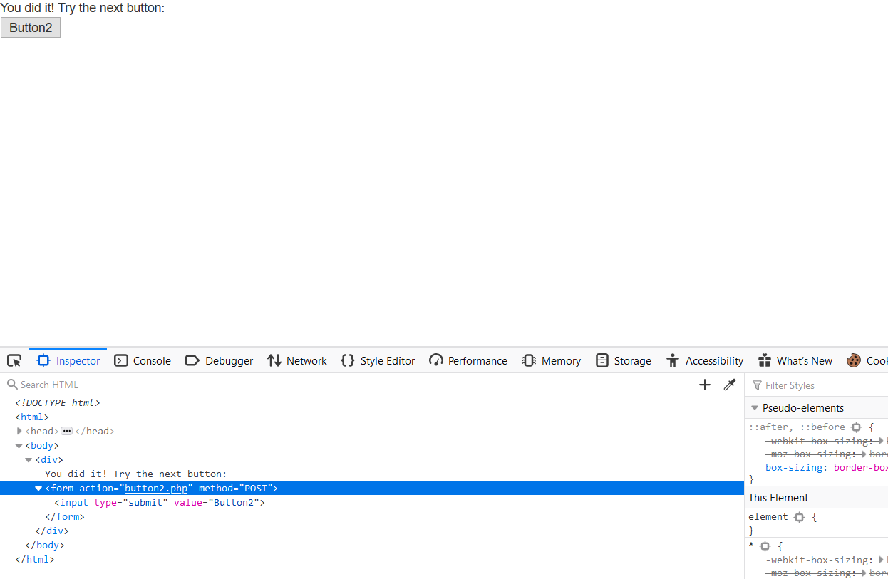
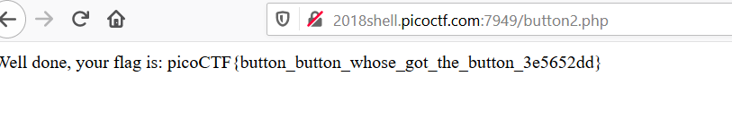

## Writeup Buttons - Points: 250
  Try to see if you can push their buttons. [Link](http://2018shell.picoctf.com:7949)
  Hints: What's different about the two buttons?

- Bài gợi ý là sự khác nhau giữa 2 button, khi mình kiểm tra thì button1 mới đúng chuẩn là button trong html, còn button2 chỉ là một
  thẻ a và khi nhấp vào nó chuyển hướng đến button2.php, chứ không phải như button 1, nhấn vào thì gửi POST request.
  Vậy mình phải thay đổi button2 để nó thành 1 button chính hiệu. Dùng chức năng inspect element, thêm vào đoạn code sau

  

- Click vào button2, vậy là ra flag: picoCTF{button_button_whose_got_the_button_3e5652dd}
  
