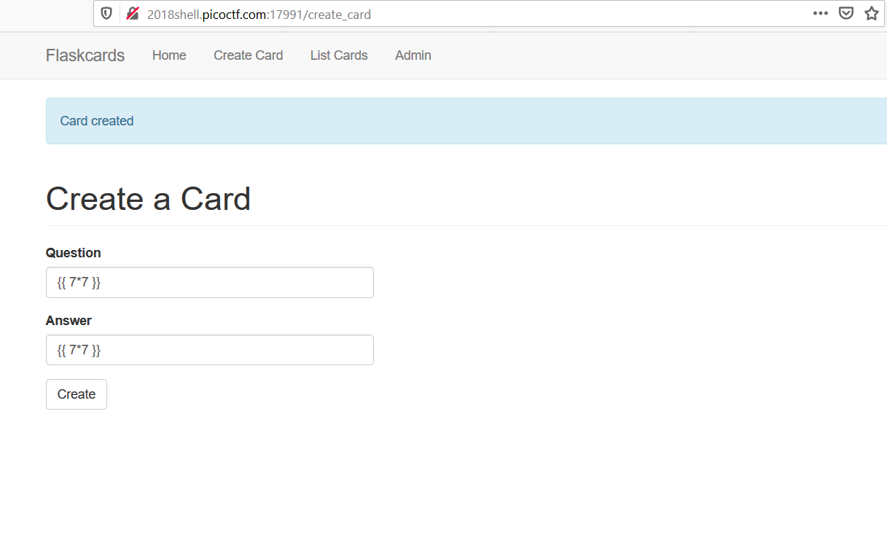
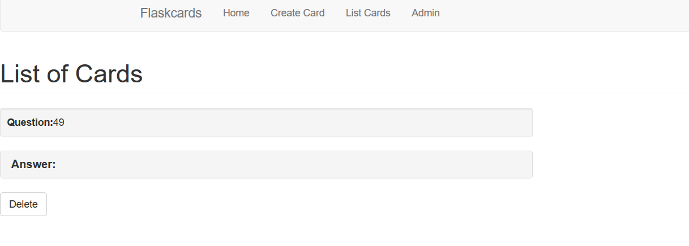
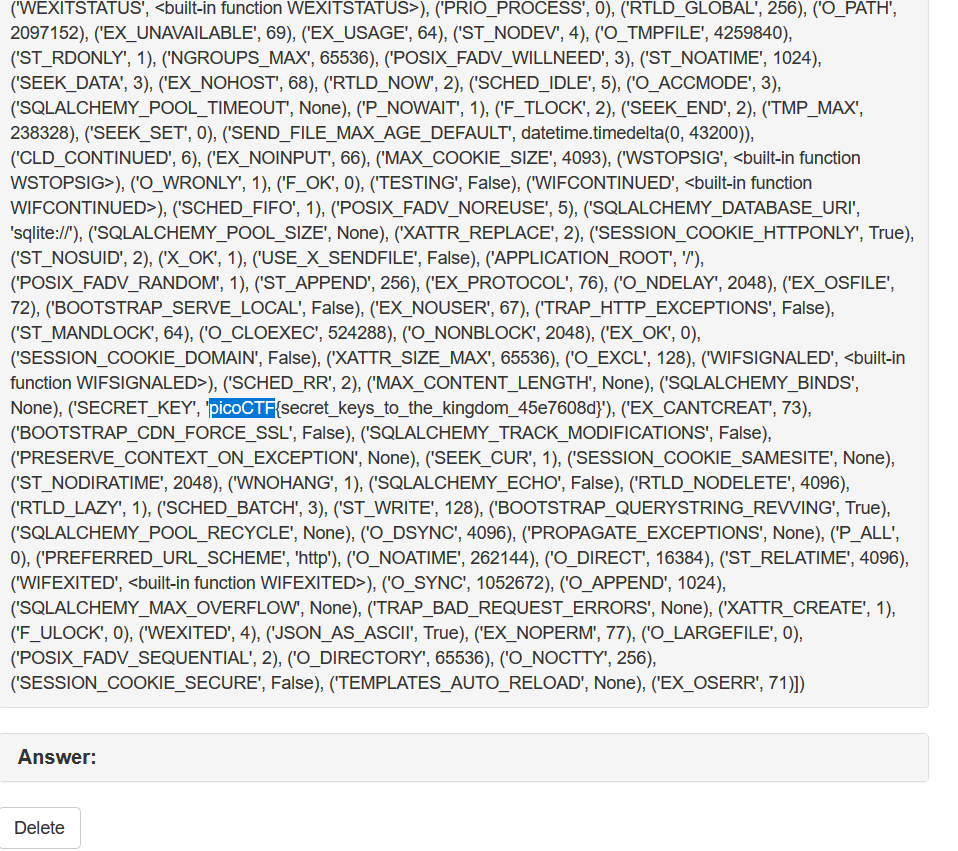

## Writeup Flaskcards - Points: 350
  [Link](http://2018shell.picoctf.com:17991/)
  We found this fishy website for flashcards that we think may be sending secrets. Could you take a look?
  Hints: Are there any common vulnerabilities with the backend of the website?
         Is there anywhere that filtering doesn't get applied?
         The database gets reverted every 2 hours so your session might end unexpectedly. Just make another user

- Bài này thuộc dạng SSTI, đọc sơ qua thì kiểu này thì ta có thể chèn code để excude code.
  Ví dụ mình nhập vào {{ 7 * 7 }} , thì theo thông thường nó sẽ hiện đầy đủ những gì mình nhập vào 
  

  Nhưng kết quả lại ra 49, vậy thì nó đã thực hiện phép tính trong đó:
  

- Vậy nếu giả sữ mình chèn vào đoạn code khác thì thế nào.
  Ok, search gg thấy vài basic injection, test thử xem thế nào, mình dùng payload {{config.items()}}
  Và nó ra flag: picoCTF{secret_keys_to_the_kingdom_45e7608d}

  