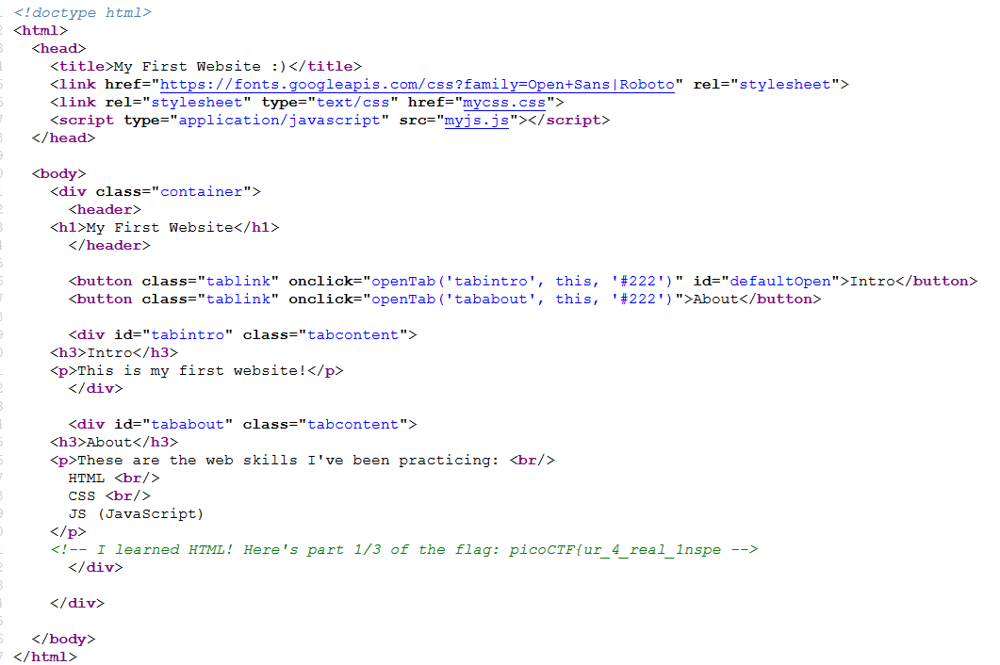
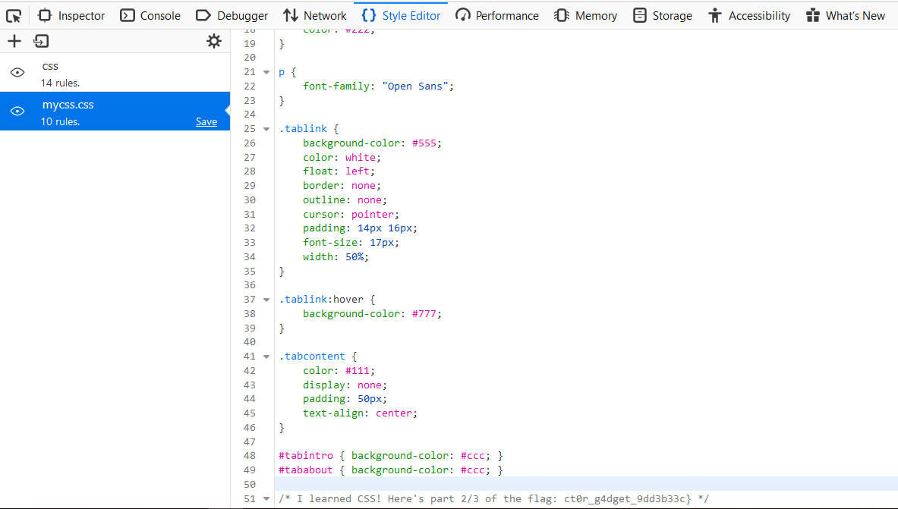
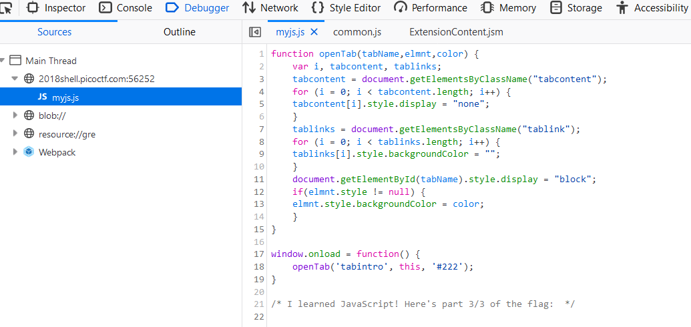

## Writeup Inspect Me
[Link](http://2018shell.picoctf.com:56252)
Hint: 
    How do you inspect a website's code on a browser?
    Check all the website code.

- Flag sẽ giấu ở ba nơi của một website, một là Ctrl + U (View Page Source)
  <!-- I learned HTML! Here's part 1/3 of the flag: picoCTF{ur_4_real_1nspe -->
  

- Đoạn thứ 2 sẽ là trong file css
  /* I learned CSS! Here's part 2/3 of the flag: ct0r_g4dget_9dd3b33c} */
  

- Đoạn thứ 3 trong file js
  /* I learned JavaScript! Here's part 3/3 of the flag:  */
  

- Ghép tất cả lại ta được flag hoàn chỉnh: picoCTF{ur_4_real_1nspect0r_g4dget_9dd3b33c}