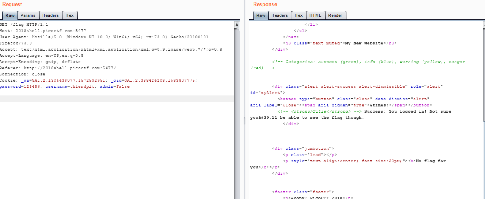

## Writeup Logon - Points: 150
  I made a website so now you can log on to! I don't seem to have the admin password. See if you can't get to the flag. 
  [Link](http://2018shell.picoctf.com:5477).
  Hints: 
    Hmm it doesn't seem to check anyone's password, except for admins?
    How does check the admin's password?

  

- Khi mình điền đại một tài khoản thì nó cho mình đăng nhập luôn, mình dùng burpsuite bắt traffic thì thấy nó có request đến 
  /flag
  

  mình thấy chỗ admin=False , ok vậy là web nó check tài khoản đó có phải là quản trị viên hay không, phải thì hiện flag,
  vậy việc mình cần làm là sửa lại thành True. Ok vậy là ra flag

  
