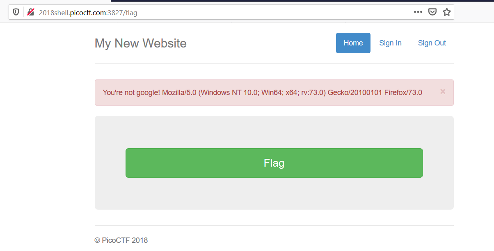
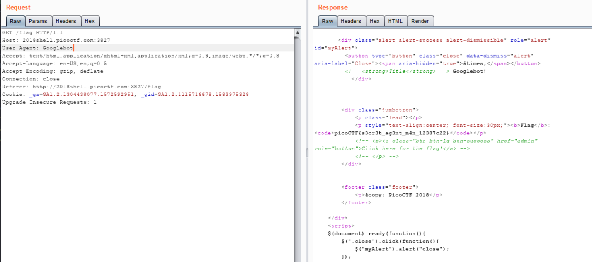

## Write up Secret Agent - Points: 200
  Here's a little website that hasn't fully been finished. But I heard google gets all your info anyway.
  [Link](http://2018shell.picoctf.com:3827)
  Hints: How can your browser pretend to be something else?

- Khi bấm vào flag thì nó hiện ra như thế này 
  
  You're not google! Mozilla/5.0 (Windows NT 10.0; Win64; x64; rv:73.0) Gecko/20100101 Firefox/73.0 
  Nó bảo mình không phải google và hiện ra thông tin user-agent của mình. Vậy là mình phải edit trường này để nó xem mình là google
  search google " google user-agent" thì nó hiện ra googlebot, chỉnh sửa và gửi request thử thì ra flag: 
  picoCTF{s3cr3t_ag3nt_m4n_12387c22}
  