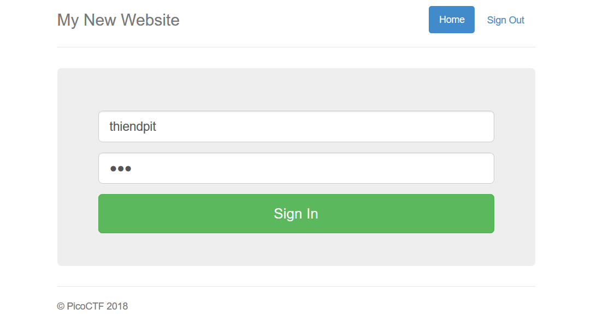
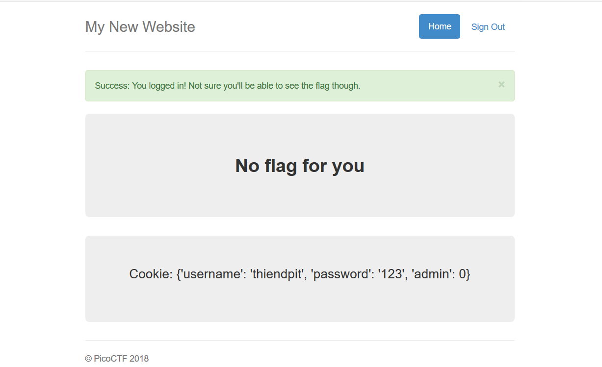
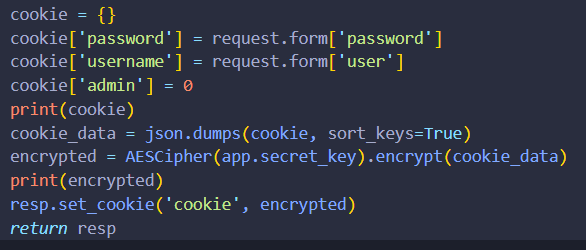
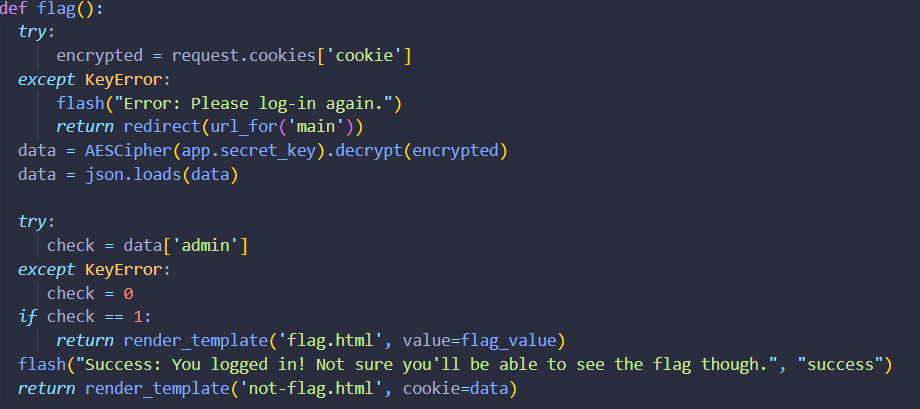
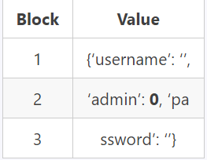
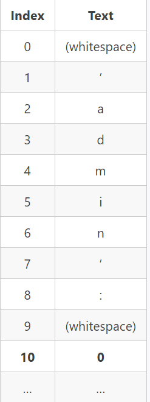
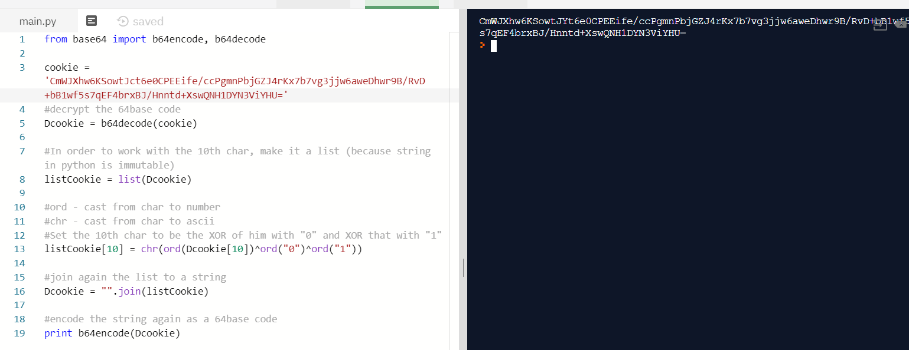
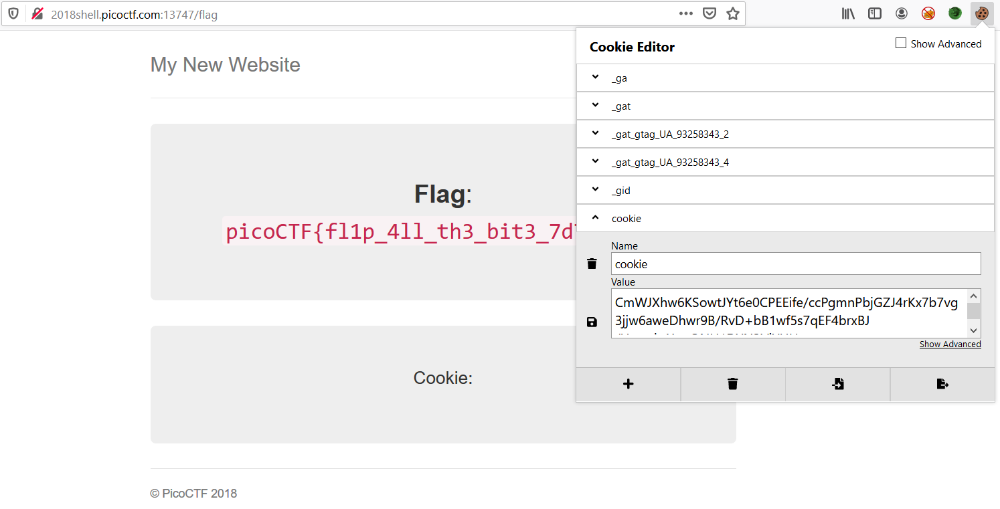
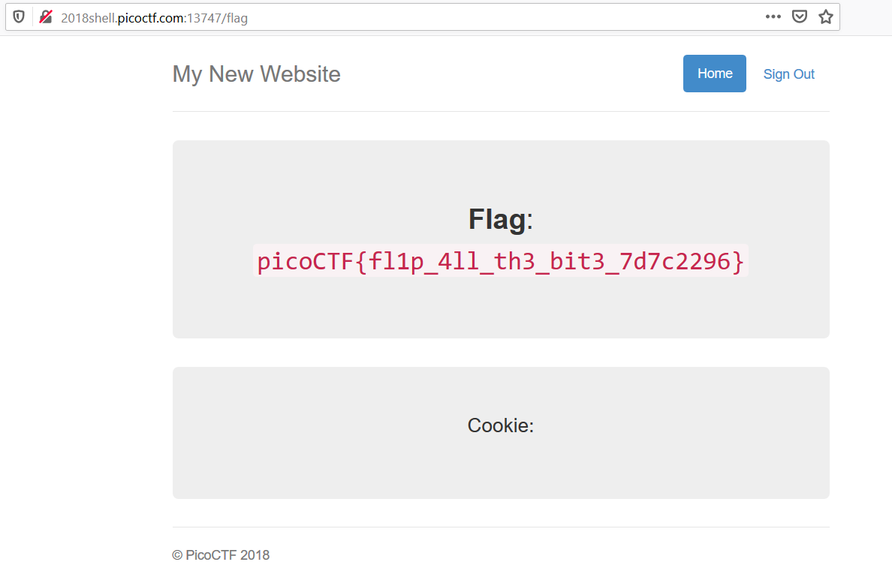

## Secure Logon - Points: 500
  [Link](http://2018shell.picoctf.com:13747)
  Uh oh, the login page is more secure... I think.
  Hints: There are versions of AES that really aren't secure.
  Source: server_noflag.py

- Bài này liên quan đến cbc bit flipping attack
  Vào web coi thử hoạt động thế nào thì web này cho phép đăng nhập bất kì user trừ admin
  

- Nhập đại thiendpit/123
  
  ta để ý thấy trường cookie có username,password và 'admin':0, vậy theo suy đoán ta phải làm sao để thay đổi
  admin : 1 thì ra flag.
  
- Đọc source thì ta thấy phần này:
  
  cookie sẽ bị mã hòa AES, xem tới hàm flag thì ta thấy, nó sẽ giải mã rồi sau đó kiểm tra admin có bằng 1 không,
  có thì ra flag, không thì no flag, cách hoạt động là vậy.
  
  ta muốn thay đổi 0 thành 1 thì xem thử nó ở vị trí nào
  
  mỗi block có 16 byte, vậy 0 ở block 2 và byte thứ 10
  
  
- ok ta code (solve.py)
  và kết quả
  
  bây giờ ta lấy đoạn cookie đã thay admin : 1 này thay thế cookie cũ 
  
  Và chúng ta có flag: picoCTF{fl1p_4ll_th3_bit3_7d7c2296}
  